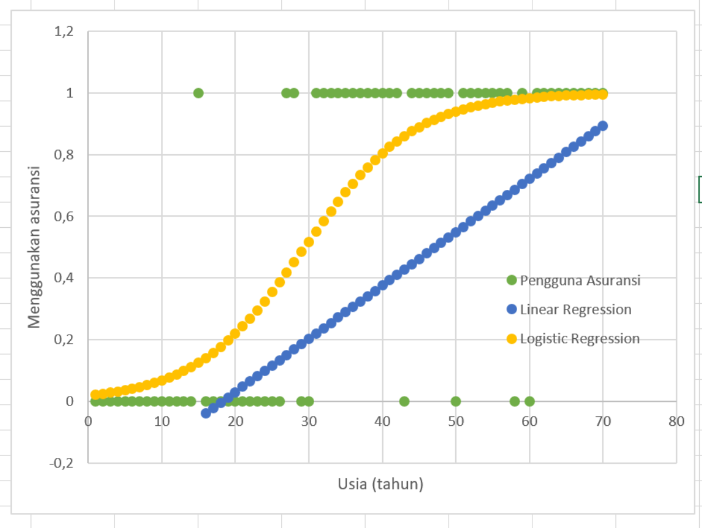
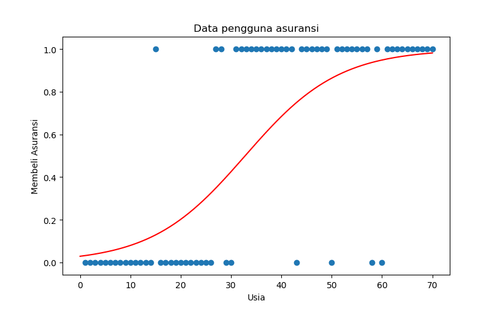

# Sklearn: Logistic Regression

### **Basic Formula**

In statistics, __logistic regression__ is a predictive analysis that used to describe data and to explain the relationship between one dependent binary variable and one or more nominal, ordinal, interval or ratio-level independent variables. Here is the basic formula of logistic regression:


#

### **Using Microsoft Excel**

Here is the example of linear regression using Microsoft Excel. Clone/download this repo & open file: __*0_logisticRegression.xlsx*__:



#

### **Using Sklearn on Python**

Clone/download this repo, open & run python script: __*3_logReg_plot1.py*__. It will create a plot figure of dataset with its best fit line. Make sure you have installed __*pandas*__, __*numpy*__, __*matplotlib*__ & __*sklearn*__ packages!

```python

import numpy as np
import pandas as pd
import matplotlib.pyplot as plt

df = pd.read_csv('1_data.csv', sep=',')
# print(df)

# =========================================
# split datasets = data train & data test

from sklearn.model_selection import train_test_split
x_train, x_test, y_train, y_test = train_test_split(
    df[['usia']], 
    df['beliAsuransi'], 
    test_size=.1
)

# =========================================
# logistic regression

from sklearn.linear_model import LogisticRegression
model = LogisticRegression(solver='lbfgs')

# training model
model.fit(x_train, y_train)

# m coef & b intercept
print(model.coef_)
print(model.intercept_)

# accuracy
print(model.score(x_train, y_train))

# =========================================

# prediction
# print(x_test)
# print(model.predict(x_test))
print(model.predict([[40]]))

# probablility
# print(model.predict_proba(x_test))
print(model.predict_proba([[40]]))

# =========================================

# plot dataframe
plt.scatter(df['usia'], df['beliAsuransi'])

dataplot = np.linspace(0,70,150)
def plotlogreg(line):
    return 1 / (1 + np.exp(-line))
bestfit = plotlogreg(
    (model.coef_ * dataplot) + model.intercept_).ravel()

# plot best fit line logistic regression: sigmoid func
plt.plot(
    dataplot,
    bestfit,
    'r-'
)

plt.xlabel('Usia')
plt.ylabel('Membeli Asuransi')
plt.title('Data pengguna asuransi')
plt.show()

```



#

#### Lintang Wisesa :love_letter: _lintangwisesa@ymail.com_

[Facebook](https://www.facebook.com/lintangbagus) | 
[Twitter](https://twitter.com/Lintang_Wisesa) |
[Google+](https://plus.google.com/u/0/+LintangWisesa1) |
[Youtube](https://www.youtube.com/user/lintangbagus) | 
:octocat: [GitHub](https://github.com/LintangWisesa) |
[Hackster](https://www.hackster.io/lintangwisesa)